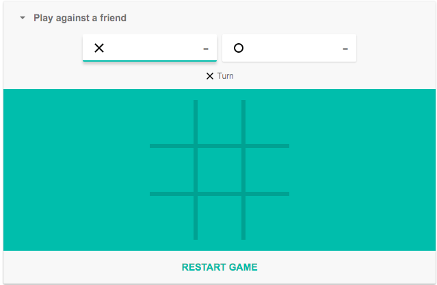

# React TDD Workshop

[](https://travis-ci.org/yanivefraim/react-tdd-workshop)


WIP - This is the repo for my [React TDD Workshop](https://www.meetup.com/Kyiv-ReactJS-Meetup/events/247392848/?_cookie-check=5Otr21FDGjz27aUV)

Welcome to my React TDD workshop!


## Getting started

```bash
npm i
npm test
```

Watch mode:

Terminal 1:

```bash
npm start
```

Terminal 2:

```bash
npm run test:watch
```

## What is this workshop about?

We will be building the [Tic Tac Toe](https://en.wikipedia.org/wiki/Tic-tac-toe) game, using React + Jest + Puppeteer, all TDD, (almost) without openning the browser!

The end result will be something like this:



## Workshop

### What we had so far (or: the parts that I'm showing during the workshop)

1. Browser test for starting a new game.
2. Browser test for displaying 'X' after first user click.
3. Browser test for 'X' user winning the game.
4. Component test for displaying 'O' after second user click.
5. Component test for 'O' user winning the game.
6. Refactor winning logic to a separate method + add unit test for it.

### Workshop tasks

1. Complete game winning logic: write unit tests for the different game winning scenarios (all rows, columns/diagonals/tie).
2. Write a component test verifiying a user cannot press a non empty cell.
3. Write a component test for a tie (show a "It's a tie!" message).
4. Write a browser/component test for marking next user in a special color (show 'X' and 'O' users and mark next user in special color).
5. Write a browser/component test for hiding registration form after game starts.
6. Write a browser/component test for hiding game board before game starts.
7. Bonus: Write a browser test for user saving / loading existing game state (use local storage for that)
7. Bonus: Write a browser test for displaying the number of wins next to each user: Win a game. Press a "new game" button, and win the game again. (Use local storage for that as well)

